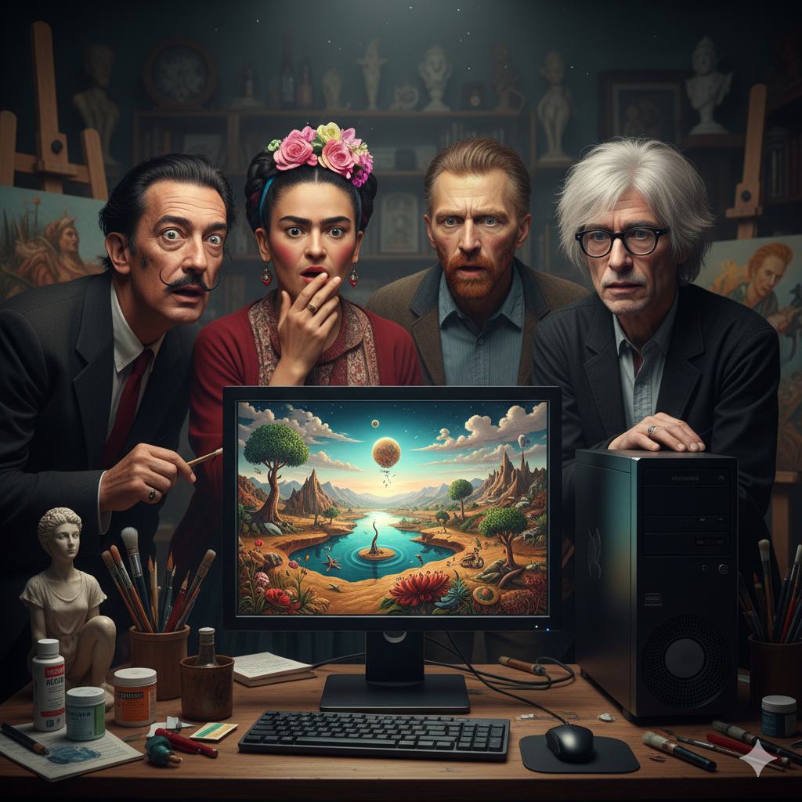

# AI Tools for Creativity

## Introduction
The AI Renaissance is here, but its not just about faster content creation — it represents a structural shift in how creative work is produced, distributed, and refined. Generative AI systems are no longer experimental novelties; they are production-grade tools integrated into artistic, commercial, and marketing workflows.

Creative AI tools generally fall into three major categories: image generation, text-to-video, and music/audio synthesis. While these systems may appear similar on the surface — all converting prompts into media — they are optimized for very different outcomes: aesthetic stylization, prompt accuracy, commercial realism, or viral experimentation.

Understanding these differences is critical. The value of AI in creative work is not in automation alone, but in how effectively a user can control, refine, and strategically deploy the system.
## Image Generation Tools
AI image generation entered the mainstream with OpenAI’s DALL·E, which uses large diffusion-based models trained on image-text pairs. The system translates natural language into visual output by predicting what image structure best matches the prompt during each denoising step.

DALL·E established a usability baseline: strong prompt adherence, simple interface, and reliable general outputs. However, its strength lies in clarity and accessibility rather than cinematic stylization.

Midjourney shifted the aesthetic benchmark. While also diffusion-based, Midjourney’s outputs emphasize dramatic lighting, texture depth, and stylized composition. Its model appears tuned toward artistic coherence rather than literal interpretation. This makes it especially strong for branding visuals, concept art, and highly stylized imagery — but sometimes weaker in strict prompt accuracy.

Meanwhile, Google DeepMind has developed advanced image systems (such as Imagen) that prioritize photorealism, text rendering accuracy, and structural consistency. These models are engineered for high-resolution commercial outputs and technical realism. They often incorporate stronger content filtering and copyright safeguards, making them more suitable for enterprise use but sometimes less flexible for experimental creators.

Strategic Trade-Offs in Image AI

Prompt Adherence (DALL·E) → Best for structured idea visualization.

Aesthetic Depth (Midjourney) → Best for artistic, cinematic outputs.

Photorealism & Structural Accuracy (Google systems) → Best for product visuals and marketing.

All three rely on diffusion processes, but their dataset curation, safety layers, and fine-tuning objectives create meaningful differences in output behavior.
The key insight: these tools are not interchangeable. They optimize for different creative priorities.

Layman’s terms:
A diffusion model starts with random visual “noise” and gradually removes that noise step-by-step until a recognizable image forms. This process is called iterative denoising.
## Text-To-Video Tools
AI text-to-video platforms have made creating short videos faster and more accessible than ever. OpenAI’s Sora 2, which I’ve used directly, allows users to turn prompts into creative video clips through an interface that functions similarly to a short-form content feed. The experience feels less like traditional editing software and more like algorithm-driven experimentation. It’s particularly strong for testing imaginative scenarios — from sci-fi and satire to stylized cinematic scenes — without requiring professional production skills.

What makes Sora 2 stand out is how quickly it translates abstract prompts into coherent visual sequences. However, like most diffusion-based video systems, it still faces limitations in physics consistency and long-duration scene stability. Access has also been restricted through waitlists, reinforcing that high-fidelity video generation remains computationally expensive.

ByteDance’s Seedance 2.0 has recently generated attention for enabling highly experimental creative mashups. Unlike more commercially restricted systems, it appears optimized for rapid generation and stylistic freedom, making it particularly suited for viral, social-media-oriented content. Its emphasis is less on perfect realism and more on speed and bold creative remixing.

Meanwhile, Google DeepMind’s Veo 3 prioritizes high-resolution output, realistic motion dynamics, and stronger copyright compliance. Compared to more experimental systems, Veo 3 feels engineered for structured, professional use cases such as marketing, tutorials, and branded storytelling. Free-tier limitations on owned intellectual property reinforce its focus on legal safeguards and enterprise readiness.

In my experience, the difference between these platforms comes down to optimization priorities:

Sora 2 → Creative accessibility and algorithmic-style experimentation

Seedance 2.0 → Rapid, viral, remix-driven content

Veo 3 → Polished realism and compliance-focused production

The technical challenge across all of them is temporal coherence. Generating a single image is computationally demanding; generating dozens of consistent frames that simulate believable motion is exponentially harder. This is why object distortion, limb irregularities, and subtle lighting inconsistencies still appear across platforms.

Together, these tools demonstrate that AI video generation is not just accelerating content creation — it is reshaping how storytelling can be prototyped, tested, and distributed at scale.

layman's terms: video diffusion works by starting with random visual noise and gradually refining it frame by frame until it becomes a clear, moving video based on your text prompt.
## Music & Audio AI tools 
AI audio systems rely primarily on transformer-based sequence modeling and, in some cases, diffusion-based audio synthesis. Unlike image models, which generate spatial data, music models generate temporal waveforms, meaning they must preserve rhythm, harmony, pacing, and tonal consistency over time.

Suno gained mainstream attention for generating complete songs — including vocals, instrumentation, and production — from short prompts. Its strength lies in speed and accessibility. Within seconds, users receive structured songs with recognizable genre patterns. However, the trade-off is limited fine-grained control over arrangement and structural editing.

Udio focuses more on composition refinement. While it also generates full tracks from prompts, it allows more iterative development and structural adjustments. This makes it better suited for users who want to shape longer compositions rather than generate quick novelty songs.

ElevenLabs specializes in high-fidelity voice synthesis rather than music production. Its models are trained to replicate tone, pacing, and emotional nuance in speech. This makes it particularly valuable for narration, audiobooks, character dialogue, and professional voiceovers. Unlike music generators, its optimization target is speech realism and controllable vocal performance.

Strategic Trade-Offs in Audio AI

Speed & Accessibility (Suno) → Best for rapid song creation.

Structural Refinement (Udio) → Better for more developed compositions.

Speech Realism (ElevenLabs) → Ideal for voiceover and narration work.

A critical limitation across music AI tools is copyright uncertainty. Because these systems are trained on large datasets of existing music, questions remain regarding stylistic replication and ownership boundaries. While platforms claim filtering systems, the legal framework is still evolving.

Audio AI is powerful, but its professional reliability depends on how much control the creator retains during iteration and editing.

layman's terms: generative audio AI works by predicting what sound should come next — note by note or word by word — until it builds a complete song or voice track based on your prompt.

## Tips For Using AI Creatively 
One of the MOST important tips for using AI creatively is to treat it as a COLLABORATOR, not a replacement. Whether you are an artist or someone with no formal creative background, start with clear and detailed prompts, then refine them gradually instead of expecting perfect results on the first try. Experiment with variations — change styles, lighting, tone, or perspective — because AI tools often produce their best results through iteration. Combine multiple tools together, such as generating an image first and then turning it into a video or adding AI-generated music, to build layered creative projects. Most importantly, always review and edit what the AI produces- your judgment, taste, and intention are what turn AI output into meaningful creative work.

## Cross-Category Analysis: What Actually Differentiates Creative AI Tools?
Across image, video, and audio platforms, three consistent variables determine performance and usability:

1. Control vs Automation

Some tools prioritize simplicity and instant output. Others provide deeper editing layers. The more automated a system is, the less granular control the creator typically has.

2. Aesthetic Bias vs Prompt Fidelity

Some models lean toward stylization and cinematic quality. Others prioritize literal interpretation and structural realism.

3. Experimentation vs Commercial Safety

Tools optimized for viral experimentation may allow broader stylistic freedom. Enterprise-focused systems often enforce stricter content filtering and copyright safeguards.
Understanding these trade-offs is more important than knowing individual tool names. The architecture (diffusion, transformers, multimodal training), dataset curation, and safety layers shape the creative behavior of the model.

## Conclusion 
AI creativity tools are no longer just experimental tech — they are actively changing how content is created and shared. From generating images in seconds to producing full videos and songs from simple prompts, these platforms are making creative expression more accessible than ever. At the same time, the technology itself isn’t the creativity — it’s the person guiding it. The real value still comes from human taste, direction, and intention. As these tools continue to evolve, the creators who stand out will be the ones who learn how to work with AI, not depend on it entirely. The AI Renaissance isn’t replacing creativity — it’s expanding what creativity can look like.
